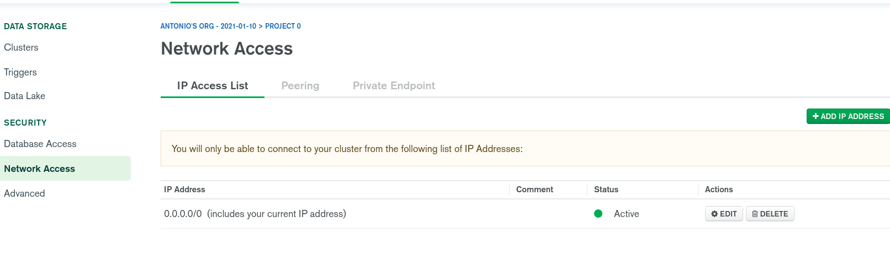
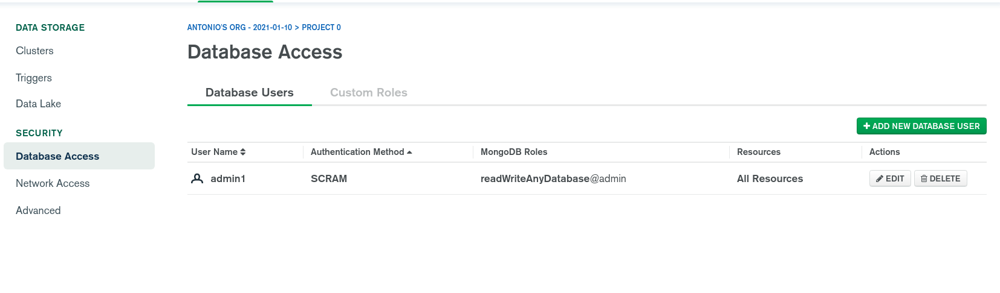
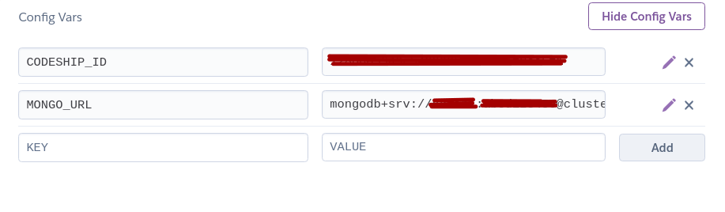
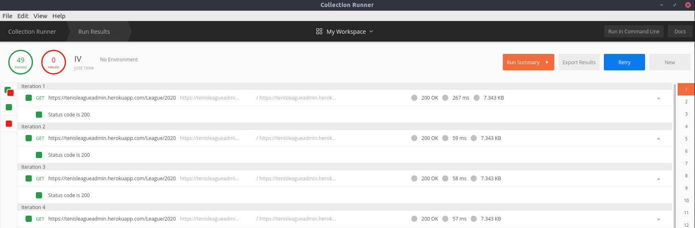
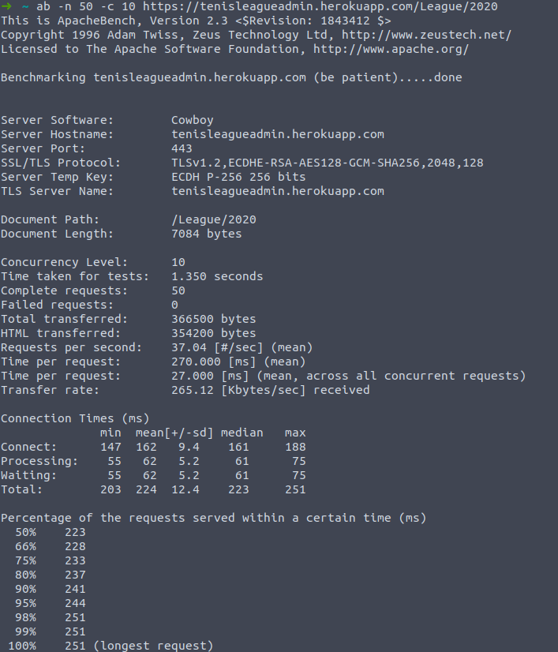

# Persistencia con MongoDB.

## Justifiación
Para implementar la persistencia en node tenía varias opciones entre las cuales se encontraban postgres, redis, kafka y la que finalmente acabé usando, MongoDB. 

Debido a que hasta el momento había usado un archivo Json para hacer todas las pruebas y mi controlador estaba ya enfocado a este tipo de estructura descarté rápidamente las bases de datos relacionales para no tener que rehacer todas las funciones. Me quedaba entonces Redis vs MongoDB. Elegí MongoDB básicamente porque tiene un enfoque más hacia archivos de tipo Json y su velocidad de recuperación es mayor sobre redis con este tipo de archivos. La otra razón fue que las ventajas que Redis tiene sobre MongoDB, como son el manejo de consultas gráficas y una mejor estructura para cálculos avanzados, no me eran necesarias en este contexto.

## Configuración

Para hacer uso de MongoDB lo primero que hice fue instalar las dependencias, como es obvio. He usado mongoose, un framework de MongoDB. 

Como se menciona en el apartado de la configuración de heroku, heroku tiene addons para este tipo de funcionalidades como son el agregar bases de datos, y para MongoDB era así hasta hace bien poco que se dejo de sostener por parte de Mlab, que era la empres que sostenía este addon. Por lo tanto me ví obligado a hacer un workaround y enlazar heroku con MongoDB en la nube de otra forma. El primer paso fue registrarme en MongoDB atlas, crear un cluster y habilitar el acceso a este cluster para cualquier dirección IP.

El siguiente paso fue crear un usuario de la base de datos con los derechos pertinentes.

Para poder conectar la aplicación necesitamos una clave que tenemos que generar con nuestras credenciales

Una vez tenemos esta clave debemos guardarla en heroku en nuestras variables de entorno para que esta tenga acceso a nuestra base de datos. Para ello podemos hacerlo mediante el CLI de heroku o en settings Config vars. 

## Accediendo desde el código

### Conexión

Para realizar la conexión necesitamos la url de la base de datos. Esta la vamos a tener en las variables de entorno si estamos ejecutando la aplicación en heroku, o en el archivo de configuración si estan local.

~~~
const mongoose = require("mongoose");
const url = process.env.MONGO_URL || config.service.url;

mongoose.connect(url, {useNewUrlParser: true, useUnifiedTopology: true})
    .then(db => console.log("db connected"))
    .catch(err => console.log(err));

var conn = mongoose.connection;

~~~

Lo primero que hacemos una vez el controlador es llamado es actualizar los datos locales por medio del método init.

~~~

    async init(){
        conn.once('open', function () {

            conn.db.collection("leagues", function(err, collection){
            
                collection.find({}).toArray(function(err, data){
                
                    leagues = data;
  
                })
            });
        });    
    }
~~~

Y despúes de cada consulta vamos a volver a actualizarlos.

~~~

    updateDB(){
        conn.db.collection("leagues", function(err, collection){
            
            collection.find({}).toArray(function(err, data){
            
                leagues = data;

            })
        });
        
    }
~~~

## Pruebas de carga.

He realizado dos pruebas de carga, la primera ha sido con postman configurando 50 petciones a https://tenisleagueadmin.herokuapp.com/League/2020 y configurando el test para que pase si el status devuelto es 200.

Todas las iteraciones pasaron y el tiempo total fue de 3.453s. Los resultados se han exportado a un [archivo json](./images/postmantest.json). 

He realizado otra prueba de carga usando Apache Bench para conseguir más datos significativos y poder hacer las peticiones concurrentemente.

