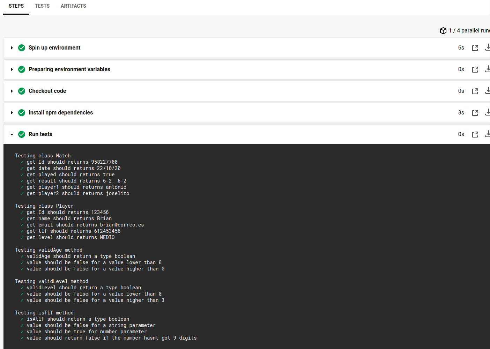

# Integración continua en Circle Ci.

## ¿ Qué es Circle Ci  y cómo usarlo ?
Circle CI al igual que Travis ofrece un servicio de integración continua alojado. El proceso para poder usarlo es bastante similar e incluso más intuitivo que Travis. 

+ Registro. Nos ofrece la posibilidad de resgistrarnos directamente con nuestra cuenta de github. Deberemos aceptar los requisitos para ello.

+ Conectamos nuestro repositorio, el proceso es super sencillo, simplemente elegimos nuestro repositorio y lo enlazamos

+ Una vez tenemos nuestro repositorio enlazado nos da la opción de crear automáticamente el set up o hacerlo manualmente. En nuestro caso lo haremos manualmente, para ello basta con crear en la raiz del proyecto una carpeta .circleci y dentro nuestro fichero de configuración [config.yml](/.circleci/config.yml).

Una vez seteado todo, cada vez que hagamos push a nuestro repositorio en github la configuración que tengamos puesta en este archivo se lanzará, ejecutando lo que hayamos escrito. En nuestro caso, los tests.

## ¿ Por qué Circle Ci ?

Para elegir mi segundo método de integración continua me he indagado en internet un poco, las opciones que barajaba eran Circle Ci y Shippable. Si bien es cierto que no hay unanimidad al respecto, muchos usuarios coinciden:

- Facilidad de puesta en marcha
- Integración con github
- Velocidad 
- Soporte 
- Documentación
- Features

Enlaces principales consultados son [este](https://www.capterra.com/continuous-integration-software/compare/150380-171025/CircleCI-vs-Shippable), [este](https://stackshare.io/stackups/circleci-vs-shippable) y [este](https://stackshare.io/stackups/circleci-vs-jenkins-vs-shippable).Si bien hay que decir que he encontrado más testimonios de usuarios de Circle CI que de Shippable.

## Uso en el proyecto

Al igual que Travis, aquí todo pasa por un fichero de configuración como ya hemos mencionado,[config.yml](/.circleci/config.yml). En este caso nuestro fichero se divide en dos:

En esta primera parte especificamos la version de circle ci a usar y a continuación definimos el trabajo que vamos a realizar. En nuestro caso se realiza solo uno y le hemos dado como nombre run_tests. Dentro de este apartado especificamos la imagen de docker a utilizr y los pasos para ello. Siendo el primero ejecutar nuestras dependencias y por último, lanzar el comando propio. 
~~~
  version: 2.1
jobs:
    # Task name we give it to use it in our workflow
    run_tests:
        docker:
            # This is the image we are going to use
            - image: circleci/node:lts

        steps:
            - checkout
            - run: 
                # Install our dependencies (mocha and chai)
                name: Install npm dependencies
                command: |
                    npm install --save
            - run:
                # Trigger our tests
                name: Run tests
                command: |
                    npm test
~~~

En este segundo bloque, especificamos nuestro workflow, donde le damos el nombre "node-tests" y los trabajos que va a lanzar, en este caso run_tests

~~~
workflows:
    #Name of the task
  node-tests:
    #Jobs to run
    jobs:
      - run_tests

~~~

Una correcta salida se ve a continuación, y para consultar el historial de builds siga [este enlace](https://app.circleci.com/pipelines/github/antOnioOnio)

## Problemas

He de decir que los principales problemas que he tenido han sido con el archivo de configuración y las indentaciones, por ello decidí instalar un validaor local de archivos de configuración. La documentación puede encontrarse [aquí](https://circleci.com/docs/2.0/local-cli/).
