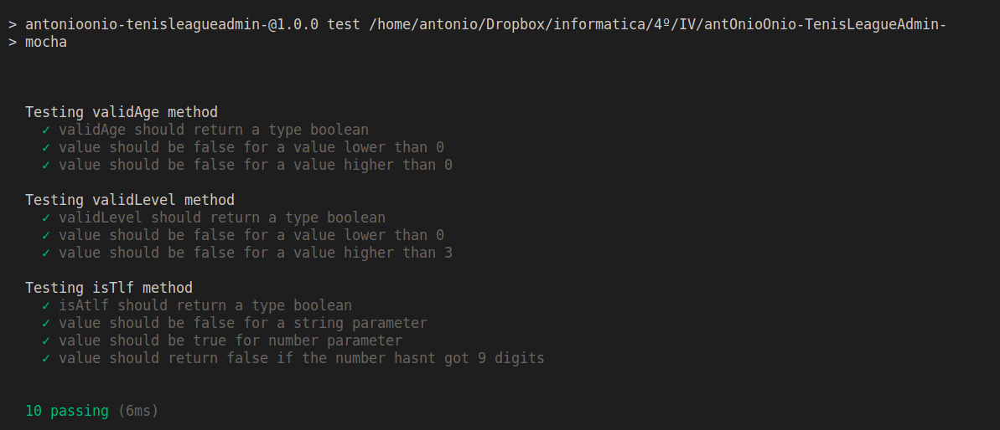

# Testeando
Entre la amplia gama de librerías que nos podemos encontrar para el testeo de código (Jasmine, Expresso, Should, NodeUnit, jsUnit) en este proyecto se va a utilizar [mocha](https://mochajs.org/) junto con [chai](https://www.chaijs.com/). La razón principal es porque es la opción más recomendada por la comunidad, y ya que es la primera vez que uso una biblioteca de este tipo, que mejor que hacerlo con las herramientas más usadas.

+ El primer archivo de test lo puedes consultar [aquí](/test/player_test.js). 
+ La clase testeada hasta la fecha la puedes consultar [aquí](/src/models/player.js) 

## Para ejecutar los test basta con que ejecutemos el siguiente comando

    npm test

Los test se ejecutarán uno a uno. La salida debe ser así:

