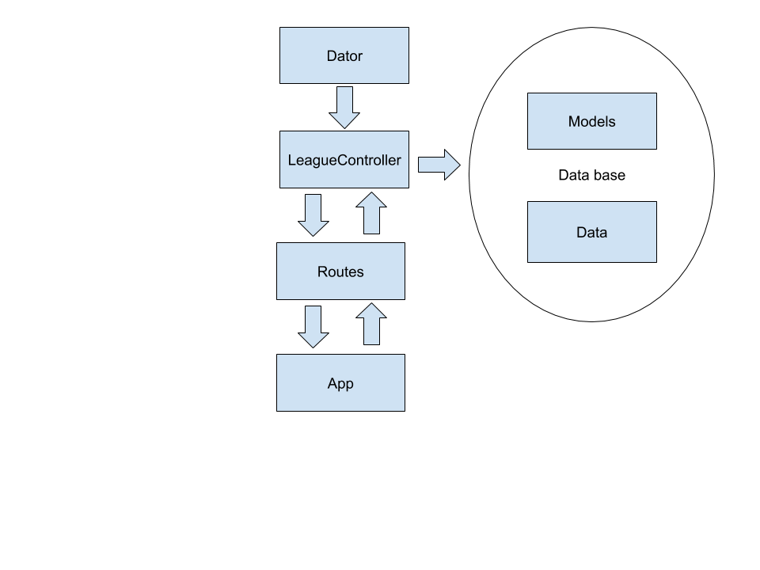
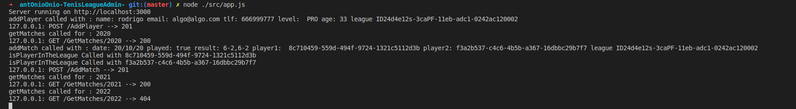

# Diseño General de la API

## Estructura

Se ha seguido un diseño por capas con el objetivo de aislar y desacoplar lo máximo la lógica de negocio de nuestra API así como de cualqueir acceso a nuestros modelos de datos. En la siguiente imagen se muestra la estructura seguida que paso a explicar.

**Dator.** Es una clase abstracta que va a definir una serie de métodos los cuales vamos a implementar forzosamente para añadir datos a nuestra aplicación. Cualquier clase controladora de nuestra aplicación debe extenderla e implementar los métodos que en esta se definan. Esta implementada en [este archivo](../src/controller/Dator.js)

**LeagueController.** Es nuestra clase controladora. Al ser la clase controladora debe extender a nuestra clase abstracta Dator. Esta clase como se muestra en el diagrama va a recibir una serie de peticiones y es la encargada de manejarlas y devolver los datos correspondientes accediendo para ello a la base de datos. Esta clase esta implementada en [este archivo](../src/controller/LeagueController.js)

En su constructor observamos como inicializamos un array de ligas a partir de los datos "fake" almacenados en el json.
~~~
 constructor(){
        super();
        this.leagues = new Array();
        Object.entries(fakeData).forEach(([key, value]) => {
            var league = new League();
            league.fromJson(value);
            this.leagues.push(league);
        })
    }
~~~

**Data.** Contiene la base de datos que se esta usando temporalmente en forma de json. Puede ser consultado [aquí](../src/Data/data.json)

**Models** Son los modelos de datos implementados y sus métodos propios. Tenemos [league](../src/models/league.js), [match](../src/models/match.js) y [player](../src/models/player.js)

**Routes.** Hapi permite separar los endpoints declarados en un fichero nuevo, ayudando bastante a la modularidad y separación de procesos. Las rutas van a ser "levantadas" una vez se inicialice nuestro servidor desde nuestra aplicación, recibirán las peticiones desde la app, las validarán, trasmitirán en caso de ser válidas a nuestra clase controladora y devolverán el estado oportunno. Este archivo puede consultado [aquí](../src/route.js).

**App.** Es el encargado de configurar e inicializar el servidor. He decidido separar la definición del servidor de las rutas para modularizar lo máximo posible y tener un código más claro y leíble. Este archivo puede ser consultado [aquí](../src/app.js)

## Rutas

En cada enlace encontrará información información relevante acerca de cada endpoint como son tipo devuelto, parámetros necesitados, respuesta, formato de respuesta y en caso de que sea de tipo POST, el payload necesario.

* [GetLeagues](./rutas/GetLeagues.md)
 
* [GetLeague/{year}](./rutas/GetLeague.md)

* [GetPlayers/{year}](./rutas/GetPlayers.md)

* [GetPlayer/{id}](./rutas/GetPlayer.md)

* [AddPlayer](./rutas/AddPlayer.md)

* [GetMatches/{year}](./rutas/GetMatches.md)

* [GetMatch/{id}](./rutas/GetMatch.md)

* [AddMatch](./rutas/AddMatch.md)

## Estados HTTP Devueltos

* **200.** Nuestra petición ha tenido éxito.
* **201.** Nuestra petición de añadir un objeto ha tenido éxito.
* **404.** No hay contenido que devolver. 

## Logging

Configurar bien un sistema de loggin es crucial, tanto para saber quien esta realizando las peticiones como para detectar problemas y solucionarlos rápidamente. Personalmente prefiero tener información siempre de más. Hapi facilita bastante las cosas a la hora de implementar un sistema de logging. Basta añadir la siguiente línea de código a la hora de configurar el servidor y todas las peticiones así como los estados devueltos son logeados:

~~~
    server.events.on('response', function (request) {
        console.log(request.info.remoteAddress + ': ' + request.method.toUpperCase() + ' ' + request.path + ' --> ' + request.response.statusCode);
    });

~~~

Adémas, me gusta conocer el flujo de la aplicación y donde se ha detenido o tenido el error. Para ello realizo un logeo en cada método una vez es invocado y los parámetros que estos tienen. Por ejemplo si llamamos a AddMatch:

~~~
addMatch(date, played, result, player1, player2, leagueId){
    console.log("addMatch called with : 
            date: " +date+ " played: " + played + " result: " + result +
            " player1:  "+ player1+ " player2: " + player2+ " league ID" + leagueId  );
        
~~~

De esta forma podemos ver el flujo de peticiones que recibe el servidor :

Cualquier error también es logeado gracias a que se ha configurado también antes de inicializar el servidor:

~~~
process.on('unhandledRejection', (err) => {
    console.log(err);
    process.exit(1);
});
~~~

## Validación

La validación de las peticiones es muy importante, para llevarla a cabo he usado un componente del framework de Hapi que se llama Joi. Este intercepta la petición y nos permite valorar si los parámetros pasados son válidos. Un ejemplo de su uso lo podemos encontrar en la definición de la ruta /GetLeagues

~~~
{
    method: 'GET',
    path: '/GetLeagues/{year}',
    options:{

        validate: {
            query:Joi.object({
                year: Joi.number()
                .integer()
                .min(1900)
                .max(2023),
            }),  
            options:{
                allowUnknown: true,
                abortEarly: false
            },
            failAction: async (request, h, err) => {
                console.log(err);
                throw err;
            },
        }
},

~~~

En este caso nos queremos asegurar de que el año pasado como argumento sea un entero y que como mínimo sea 1900 y como máximo 2023. Veamos otro ejemplo ;

~~~
{
    method: 'GET',
    path: '/GetPlayer/{id}',
    config:{
        validate: {
            params:Joi.object({
                id: Joi.string().min(5).required()
            }),  
            options:{
                allowUnknown: true,
                abortEarly: false
            },
            failAction: async (request, h, err) => {
                console.log(err);
                throw err;
            },
        }
    },

~~~
En este otro caso queremos asegurarnos que el identificador único del jugador que pasamos sea un string, que como mínimo tenga 5 carácteres y que es requerido.

Si por ejemplo queremos validar una petición post en la que es requerido que haya un payload:

~~~

{
    method: 'POST',
    path: '/AddMatch',
    options:{
        validate: {
            payload:Joi.object({
                date: Joi.string().required(),
                played: Joi.boolean().required(),
                result: Joi.string().required(),
                player1: Joi.string().min(5).max(50).required(),
                player2: Joi.string().min(5).max(50).required(),
                leagueId: Joi.string().min(5).max(50).required()
            }),
            options:{
                allowUnknown: true,
                abortEarly: false
            },
            failAction: async (request, h, err) => {
                console.log(err);
                throw err;
            }
        }
    }, 
~~~

En este caso vamos a validar todos los campos del payload necesarios para añadir un partido, podemos diferenciar tipos, si son o no requeridos, mínima longitud etc.