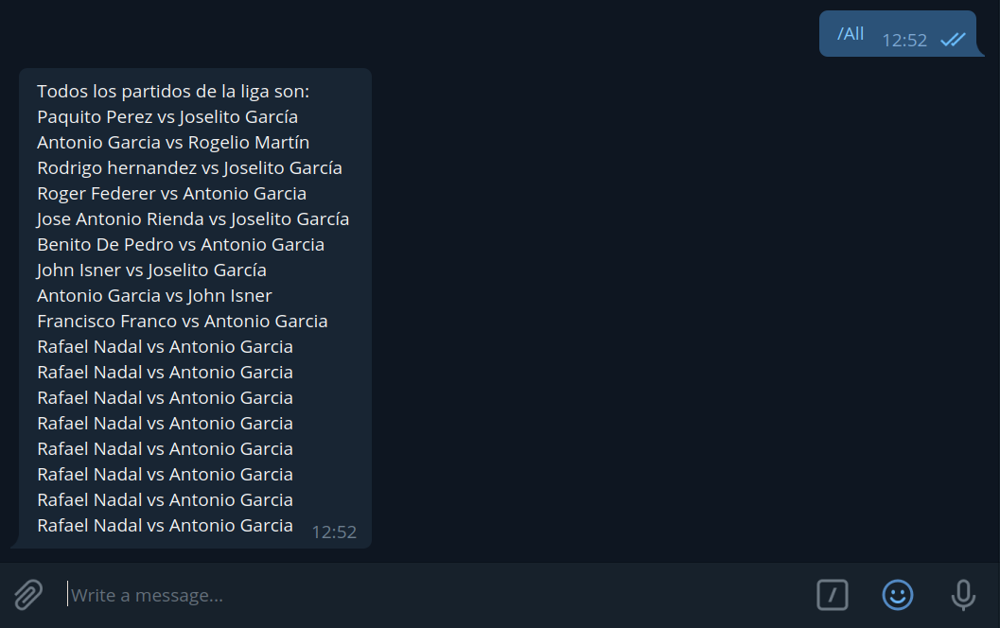
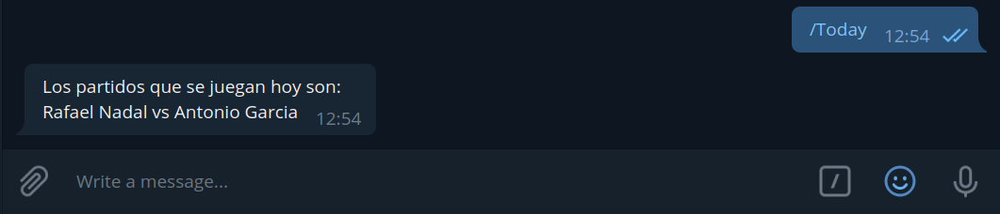
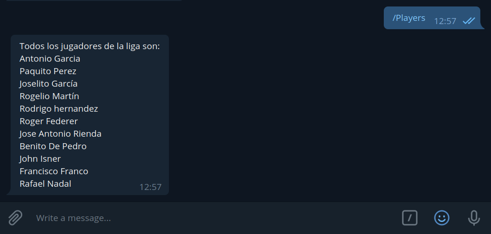
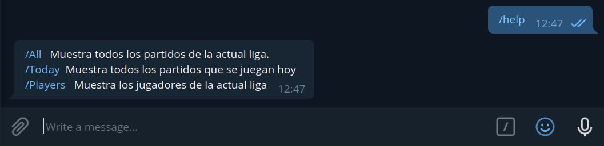
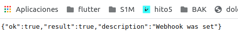

# Despliegue de bot en Telegram con Firebase

Para empezar a trabajar con firebase obviamente lo que debemos hacer es registrarnos e instalar las dependencias necesarias, este proceso se explica en el [ejercicios de autoevaluacíon](https://github.com/antOnioOnio/IV-autoevaluacion/blob/master/serverles.md#firebase) realizado previamente.

## Configuración y pasos previos

El proceso es bastante simple, primero ejecutamos en la terminal el siguiente comando:

    firebase init functions

Seguimos los pasos indicados, linkeamos con nuestro proyecto creado en firebase y ya tendremos nuestra estructura principal creada. Nuestro fichero desde donde vamos a controlar nuestro bot es [/telegramBot/functions/index.js](../telegramBot/functions/index.js).

Para poder crear un bot, telegram nos lo pone muy facil. El primer paso es conseguir una Telegram API key, para ello debemos abrit telegram, buscar el BotFather e indicar mediante unos sencillos pasos que vamos a crear un bot. Este nos devolverá  nuestra API key, la cual debemos guardar. 

Para el desarrollo de nuestro bot vamos a hacer uso del framework diseñado para telegram y node telegraf. Nos facilita bastante la tarea, la documentación se encuentra [aquí](https://telegraf.js.org/#/?id=features)

### Variables de entorno

Como es obvio no podemos dejar nuestras variables importantes a la vista de todos, ya que cualquier podría apoderarse de ellas y controlar nuestro bot o coger datos sensibles. Firebase para ello nos proporciona el siguiente comando. 

    firebase functions:config set <key>="<Nuestra variable>"

Una vez seteada para recuperarla basta ejecutar 

    functions.config().key

He de decir que aunque el método me funciona bien al mostrar el contenido de forma local, a la hora de hacer pruebas me dio ciertos fallos, por lo que un workaround realizado fue el volcar la información en un archivo env.json para en caso de fallar asegurarme de que los datos se encuentren correctamente. Este archivo como es obvio se añadió al .gitignore. 

# Archivo principal

Como ya hemos dicho nuestro archivo desde donde vamos a controlar las llamadas y respuestas de nuestro bot es [/telegramBot/functions/index.js](../telegramBot/functions/index.js). 

Vamos a comenzar declarando nuestras dependencias necesarias.

~~~
const functions = require('firebase-functions');
const { Telegraf } = require('telegraf');
const fetch = require('node-fetch');
let config = require('./env.json');
~~~

* Firebase-functions obviamente lo usamos para obetener las utilidades que ofrece como desplegar, ver logs, guardar variables etc.
* Telegraf es nuestro framework elegido en el cual desarrollaremos el código para desplegar nuestro bot.
* node-fetch lo usaremos como paquete para realizar nuestras llamadas a la API.
* El archivo env.json me he visto forzado a crearlo como ya se ha mencionado en el apartado anterior.

~~~
if (Object.keys(functions.config()).length){
  config = functions.config();
}

const bot = new Telegraf(config.service.telegram_key);

var urlPlayers = "https://tenis-league-admin.vercel.app/api/players";
var urlMatches = "https://tenis-league-admin.vercel.app/api/matches";

var settings = { method: "Get" };
~~~

El primer paso es registrar nuestro bot con nuestra API key que telegram nos dio, como se ha comentado antes tuve problemas a la hora de hacer uso de la funcion functions.config(), por lo que previamente se guardo en un archivo local. 
A continuación vamos a declarar nuestros endpoints y una variable que guarde la configuración con la que vamos a realizar nuestras peticiones. 

Para ilustrar el funcionamiento de una petición vamos a centrarnos en /Today.

~~~

bot.command('Today', async (ctx) => {

  let res = 'Los partidos que se juegan hoy son:\n';

  await fetch(urlMatches+"?date=today", settings)
    .then(res => res.json())
    .then((json) => {

      if ( json.length > 0){

        for( var i = 0; i < json.length ; i++){ 
          res +=  "" + json[i]._player1 + " vs " + json[i]._player2 + "\n";
        }

    }

    return null;
  }) 

  
  ctx.reply(res)
})
~~~

Como vemos, una vez el bot recibe la peticion "/Today" se inicia un método asíncrono en el cual se realiza una petición a nuestro endpoint donde especificamos el valor de nuestro parámetro y la configuración con la que vamos a realizar dicha petición.

Una vez devuelta la información basta con recorrer nuestro json respuesta e ir incluyendo en nuestra variable respuesta los valores que deseamos dentro de nuestro json. 

Notese el return null, el lector puede preguntarse el por qué de dicho retorno, y no es más que cada vez que declaramos un then debemos especificar un valor de retorno o un error. Tras varías horas investigando descubrí este workaround para solucionar un problema que nunca debió serlo.

## ¿ Por qué peticiones externas a la API ? 

Si bien es cierto que tanto el bot de telegram como la API están dentro del mismo proyecto y en estos casos tendría más sentido acceder directamente a ella se ha querido realizar de esta forma por las siguietes razones:
* Par poder acceder a la base de datos local hubiera tenido que desplegar tambien en firebase la base de datos local y todos los métodos implementados, duplicando bastante código. Eso o unificar ambos bajo el mismo directorio raiz, lo cual hubiera llevado a más problemas y los pros no sobrepasaban los contras
* Damos uso al servicio creado y emulamos la creación de un bot de forma paralela al proyecto.

## Bot y funciones 

El bot en cuestión puede ser encontrado en Telegram y se llama @whoIsPlayingTodayBot. Por ahora se han implementado las siguientes funciones.

* **/All** Te muestra todos los partidos de la liga. Por ahora, y para ser que el resultado sea más claro, solo se muestra quien juega los partidos, más adelante se implementará el resultado de estos si han sido jugados.

* **/Today** Muestra los partidos que se van a jugar en el día de hoy. Por ahora solo se muestra los nombres de los jugadores. La intención es que si se ha jugado muestre también el resultado.

* **/Players** Muestra los nombres de los jugadores que están inscritos en la liga actual. 

* **/help** Como otros muchos bots, te muestra las posibilidades que puedes realizar.

## Despliegue y pruebas

Para desplegar nuestro bot en firebase es bastante sencillo. Basta con ejecutar:

     firebase deploy --only functions

Para desplegar nuestro bot en local sin embargo ejecutamos:

    firebase serve

Una vez desplegado vamos a poner en marcha nuestro webhook, que es básicamente un enlace a una web que escucha cuando se produce un evento a nuestro bot y realiza una llamada a esta dirección web. De esta forma tenemos varías ventajas:

- Ahorramos CPU
- Mejoramos tiempo de respuesta
- Se evita necesidad de preguntar constantemente al bot.

Telegram pone a nuestra disposición una API y una [documentación](https://core.telegram.org/bots/api#setwebhook) bastante buena para realizar dicha tarea. Basta con conseguir nuestro token de firebase y nuestro token del bot y hacer una petición a dicha url. El resultado deberá ser:

## Integración Continua

Firebase no esta integrado como vercel con github, por lo que para mantener actualizado el bot se ha desarrollado un [workflow](/.github/workflows/firebase.yml) para desplegar en firebase cada vez que tenemos un cambio sobre nuetro bot. Evitando de esta manera innecesarias actualizaciones. 

Para la realización de esta tarea ha sido necesario visitar la [documentación](https://docs.github.com/es/free-pro-team@latest/actions/reference/workflow-syntax-for-github-actions) oficial  y [este](https://github.com/marketplace/actions/github-action-for-firebase) otro enlace.