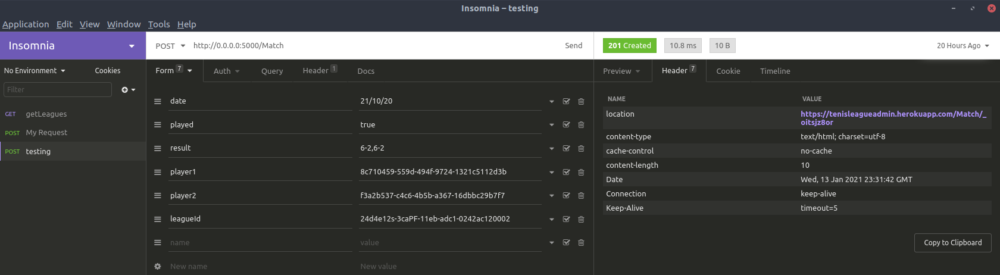
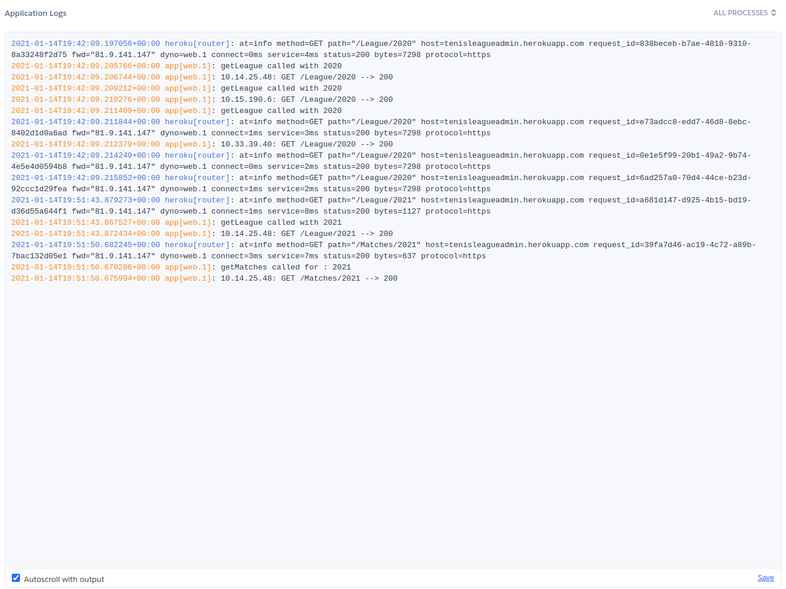

## Correcto funcionamiento de la aplicación en heroku

Se ofrecen los siguientes endpoints de tipo GET:

* [/status](https://tenisleagueadmin.herokuapp.com/status) Nos devolverá {"status": "OK"}.

* [/League](https://tenisleagueadmin.herokuapp.com/League) Nos devolverá todas ligas almacenadas en formato JSON.

* [/League/{year}](https://tenisleagueadmin.herokuapp.com/League/2020) Nos devolverá la liga jugada en el año pasado como parámetro en formato JSON.

* [/Players/{year}](https://tenisleagueadmin.herokuapp.com/Players/2020) Nos devolverá los jugadores que haya inscritos en el año pasado como parámetro en formato JSON.

* [/Player/{id}](https://tenisleagueadmin.herokuapp.com/Player/8cb64c60-6cc6-49ab-8585-3257ad2ca718) Nos devolverá el jugador con id pasado como parámetro en formato JSON.

* [/Matches/{year}](https://tenisleagueadmin.herokuapp.com/Matches/2020) Nos devolverá los partidos disputados en el año pasado como parámetro en formato JSON.

* [/Match/{id}](https://tenisleagueadmin.herokuapp.com/Match/01f5353d0-2cbd-11eb-adc1-0242ac120002) Nos devolverá los partidos disputados en el año pasado como parámetro en formato JSON.

Se han habilitado los siguientes endpoints tipo POST.

* [/Match](https://tenisleagueadmin.herokuapp.com/Match) cuyo payload tiene que ser en formato, se nos devolverá el id del objeto creado y en la cabecera Location la dirección del recurso creado.

~~~
{
  "date": "sample string 1",
  "played": boolean,
  "result": "sample string 3",
  "player1": "sample string 1",
  "player2": "sample string 2",
  "leagueId": "sample string 2",
}
~~~

* [/Player](https://tenisleagueadmin.herokuapp.com/Player) cuyo payload tiene que ser en formato, se nos devolverá el id del objeto creado y en la cabecera Location la dirección del recurso creado.

~~~
{
  "name": "sample string 1",
  "email": "sample string 2",
  "tlf": integer,
  "level": "sample string 1",
  "age": integer,
  "leagueId": "sample string 2",
}
~~~

Para probar el correcto funcionamiento de las llamadas post he usado insomnia.

En la siguiente imagen observamos el payload pasado, el status de retorno y como en la cabecera location se devuelve la uri del recurso creado.

## Logs

No he tenido que configurar nada en heroku para tener unos logs que me permitan observar el correcto funcionamiento de mi aplicación debido a dos razones. La primera es que ya viene configurado por defecto y tanto en el dashboard de la aplicación como por medio del cliente en local tenemos acceso claro a estos. La segunda razón ha sido que ya tenía configurados una serie de logs en las llamadas a los métodos clave que me permitían observar el funcionamiento de la aplicación.

