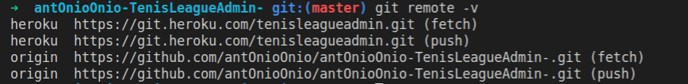
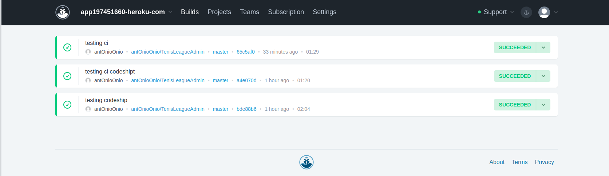

# Heroku

## Justificación

He decidido desplegar mi aplicación en heroku por distintas razones:

* Ya lo había usado en el pasado y conocía de sus facilidades.
* Una instalación del CLI muy simple y una documentación muy buena. 
* Se pueden añadir addons para añadirle funcionalidades, en mi caso he usado uno para la integración continua.
* Servicio de logs bastante bueno, en mi caso ha sido clave para la corrección de fallos.
* Servicio gratuito, aunque para algunos addons hay que añadir la tarjeta de crédito.
* Permite escalar la aplicación si fuera necesario.

## Configuración inicial

### Instalación y puesta en marcha

El proceso de instalación es bastante sencillo y no merece de una explicación extensa, basta con instalar el cliente de heroku y logearnos para empezar. 

Una vez instalado he añadido un script en el package.json para especificar a heroku el comando a ejecutar una vez desplegada la aplicación:

~~~

  "scripts": {
    "start": "node ./src/app.js"
  }

~~~

No se ha añadido Procfile, ya que como bien dice la [documentación](https://devcenter.heroku.com/changelog-items/370), si este no esta presente, se chequea y ejecuta el script aquí presentado.

### Gestión de repositorios e integración continua

Para gestionar ambos repositorios se ha añadido un enlace a heroku de forma que la configuración queda de la siguiente forma:

De esta manera se puede desplegar directamente a heroku. Pero para no estar manteniendo dos repositorios he hecho uso de un addon que gestione la integración continua mediante un pipeline. Este addon se llama [codeship](https://app.codeship.com/home), tiene plan gratuito y su instalación y puesta en marcha es muy simple; Simplemente instalamos el addon desde el dashboard de heroku y una vez instalado, desde codeship tendremos que enlazar con nuestra cuenta de github y especificar el repositorio y rama que queremos enlazar. Una vez hecho creamos nuestra pipeline, la cual desplegará en heroku una vez los test hayan pasado.

