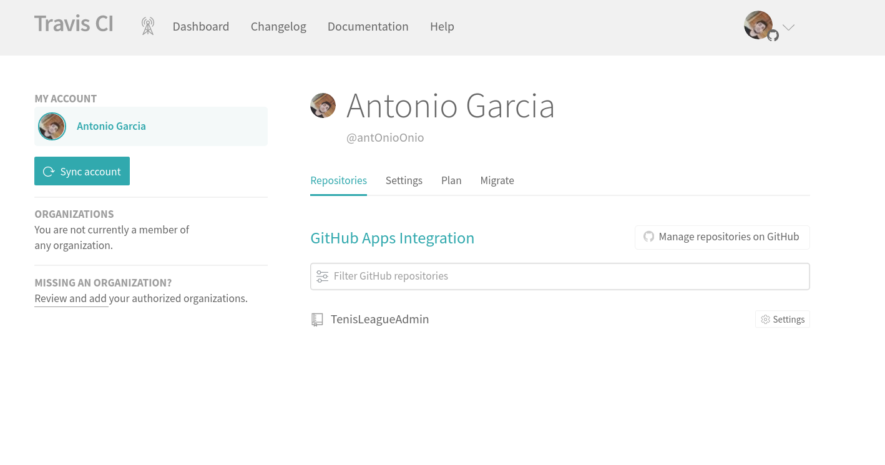
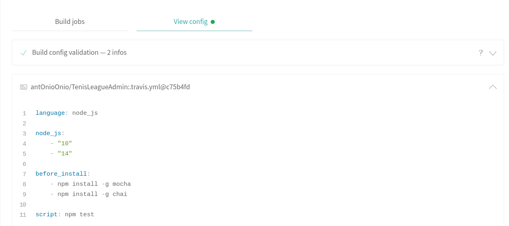

# Integración continua en Travis.

## ¿ Qué es Travis y cómo usarlo ?
Travis CI es un servicio de integración continua alojado que se utiliza para crear y probar proyectos de software. Podemos configurar dicha interacción continua para ejecutar determinadas pruebas cada vez que se interaccione con nuestro repositorio. Para poder utilzarlo tenemos que seguir unos sencillos pasos.

+ En primer lugar tenemos que registrarnos en su sitio web, pero Travis te ofrece la posibilidad de hacerlo directamente con nuestra cuenta de github.

+ Una vez nos hayamos logeado con nuestra cuenta de github debemos conectar nuestros repositorios, o repositorio si solo quieres enlazar uno. Una vez realizado nos deberá salir así:

* Ahora que ya tenemos enlazada la cuenta y el repositorio debemos añadir un archivo .travis.yml en nuestra raiz del proyecto. Este archivo será el encargado de decirle a Travis CI los pasos a seguir para ejecutar nuestros tests.

## Uso en el proyecto

Se han realizado dos tipos de ficheros aunque el final lo puedes encontrar [aquí](../.travis.yml). Como vemos en esta versión se esta aprovechando la imagen ya creada en dockerhub para realizar los tests. 
Básicamente especificamos el comando a ejecutar a través del comando "script". No es necesario ni especificar el servicio ni descargar previamente la imagen, error corregido en esta versión. Ejecutando el comando es suficiente. 

    script: docker run -t -v `pwd`:/test antonioonio/tenisleagueadmin

Un ejemplo de como se construye y ejecutan los tests puede verse [aquí](https://travis-ci.com/github/antOnioOnio/TenisLeagueAdmin/jobs/428995821/config)

El historial de builds puede ser consultado [aquí](https://travis-ci.com/github/antOnioOnio/TenisLeagueAdmin/builds)

## Distinta versión de .travis.yml

En la anterior versión de .travis.yml haciamos uso de una imagen ya generada para realizar nuestros test pero no es la única versión realizada y testeada que se ha realizado. 

En esta otra versión le especificamos diferentes versiones de node así como las dependencias necesarias y obviamente el comando a ejecutar. 

Obviamente no he utilizado esta versión porque tiene más sentido utilizar una imagen ya realizada con todo lo necesario instalado que ejecute los tests, incluso aunque por ahora nuestro archivo sea simple, que volver a instalar las dependencias. 