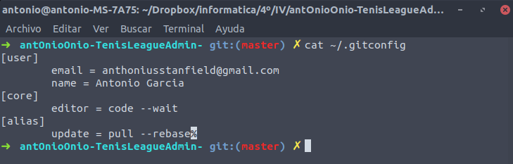
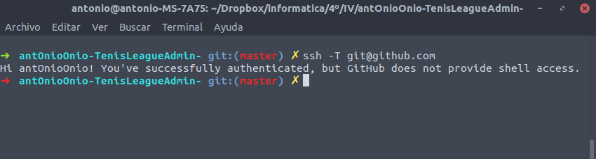
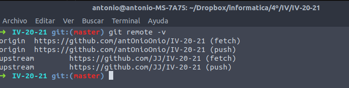

# Correcta configuración de Git

## Creación de repos

Para la correcta utilización del entorno de desarrollo de la asignatura se han creado 3 repositorios.

- [Proyecto a desarrollar](https://github.com/antOnioOnio/antOnioOnio-TenisLeagueAdmin-).

- [Repositorio de la asignatura](https://github.com/antOnioOnio/IV-20-21).

- [Repositorio para ejercicios de autoevaluación](https://github.com/antOnioOnio/IV-autoevaluacion).

## Configuración de ~/.gitconfig
Se ha creado y configurado en el home el archivo .gitconfig con la siguiente configuración

## Ssh Test
Se han creado el par de claves pública-privada y subido correctamente la pública a github. 

## Remote links

