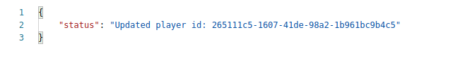

# Despliegue en Vercel

El primer paso para desplegar en Vercel obviamente es registrarnos, linkear nuestro proyecto e instalar las dependencias para poder trabajar localmente. Una explicación de estos pasos más detallada puede encontrarse en el siguiente [ejercicio de autoevaluación](https://github.com/antOnioOnio/IV-autoevaluacion/blob/master/serverles.md#vercel) desarrollado previamente.

Una vez tenemos nuestro repositorio correctamente enlazado, con cada push que hagamos a nuestro repositorio se realizará un despliegue con notificación de si ha sido exitoso o no.

## Configuración previa

Se ha creado un archivo [vercel.json](../vercel.json) donde se especifican los distintos endpoints creados y los distintos métodos que cada uno va a soportar

~~~
{
    "routes":[
        {
            "src":"/",
            "dest":"/api/matches.js"
        },
        {
            "src": "/matches", 
            "methods": [
                "POST", 
                "GET",
                "PUT"
            ],
            "dest": "/api/matches.js"
        },
        {
            "src": "/players", 
            "methods": [
                "POST", 
                "GET",
                "PUT"
            ],
            "dest": "/api/players.js"
        }
    ]
}
~~~

He especificado las rutas de tal manera que si solo escribimos nuestra url a secas nos redirija a matches como ruta por defecto.
Los métodos soportados hasta ahora son Post para insertar partidos o jugadores, Get para que nos devuelva el array de jugadores-partidos o el que especifiquemos por medio de los parámetros y PUT para actualizar nuestros modelos.

Otro archivo creado es [data.json](../api/data.json), el cual contiene los datos que por ahora se van a devolver en nuestros endpoints.

He creado una función que parsea los datos a mi modelo para manejar las peticiones y devolver los datos pedidos. La función es fromJson() y se encuentra en el archivo [league.js](../src/models/league.js)

## Archivos 

Las llamadas a la API relacionadas con los partidos se realizan desde [matches.js](../api/matches.js) mientras que las relacionadas con los jugadores se realizan desde [players.js](../api/players.js). 

La implementación de estos métodos esta escrita en nuestro fichero fuente [league.js](../src/models/league.js)

## Explicación de una función

Para conocer bien como funciona vercel vamos a centrarnos en una función de las varias desplegadas, por ejemplo. getPartidos(), la implementación total esta divididad en [matches.js](../api/matches.js) y [league.js](../src/models/league.js). Comencemos analizando el archivo matches.js

~~~
var data = require("./data.json");
const League = require("../src/models/league");

var league = new League();
league.fromJson(data);
~~~
Lo primero que hacemos es cargar nuestro archivo de datos donde tenemos implementada nuestra "base de datos", obviamente esto en un ambiente de producción no se haría así ya que usaríamos una base de datos real. El siguiente paso es declarar nuestra liga de donde se consultarán los datos. Para ello se ha implementado como se ha mencionado anteriormente el método fromJson el cual va a cargar nuestros datos a nuestro objeto liga. 

~~~
module.exports = (req,res) => {

    if (req.method == 'GET'){
        var name = req.query.name;
        var date = req.query.date;
        var matches 

        // if we dont pass name nor date we assume we want every match
        if (name == null && date == null){
            res.status(200).send(league.matches);
        }else {
            if ( name != null){
                // check first if the player is playing the league
                if (league.isPlayerInTheLeague(name)){
                    matches = league.getMatchesOfPlayer(name);
                    
                    if ( matches.length > 0){
                        res.status(200).send(matches)
                    }else {
                        res.status(204).send({status: "Player has not played yet"})
                    }
                }else {
                    res.status(404).send({status: "Bad request, that player is not in our league"})
                }
            }else if ( date != null){
                matches = league.getMatchesOfToday(date);
                
                if ( matches != null){
                    res.status(200).send(matches)
                }else {
                    res.status(204).send({status: "There are no matches today"});

                }
            }
        }

    }
}
~~~

Sobre el mismo endpoint se van a realiar peticiones de distinto tipo, por esta razón lo primero que debemos comprobar es qué estamos buscando, para ello basta con acceder al tipo de request que se esta realizando a través de req.method.

Para responder a peticiones específicas *como obtener el resultado de un partido*  o *quién juega hoy* se montan parámetros sobre nuestro endpoint, por eso el siguiente paso que debemos realizar es reconocer estos parámetros y devolver la información correcta. En este caso lo primero que hacemos es comprobar name y date, si ambos son nulos significa que lo que estamos buscando es una lista de todos los partidos en cuyo caso devolvemos el resultado por medio de res.status(200).send(league.matches) en forma de json. 

Aunque llegados a este punto la función que queríamos explicar esta explicada, unas palabras sobre el resto del método nunca estan de más. Obviamente el siguiente paso sería diferenciar si estamos buscando el partido relacionado con un jugador en específico o estamos buscando un partido jugado en una fecha.

## Funciones desplegadas

Como se ha mencionado antes se han configurado lost endpoint para que también acepten el método POST. Simplemente en nuestro archivo vamos a diferenciar si la petición es get o post y actuar en consecuencia. Los métodos implementados son los siguientes:

- **getPlayers()**. Esta función ha sido desplegada en [este](https://tenis-league-admin.vercel.app/api/players) endpoint. Nos va a devolver todos los jugadores que estan actualmente jugando la liga. Usando postman podemos comprobar que la salida es correcta. 

- **getMatches()**. Esta función ha sido desplegada en [este](https://tenis-league-admin.vercel.app/api/matches) endpoint. Nos va a devolver todos los partidos pertenecientes a la liga, se hayan jugado o estén por jugar.

- **getMatchesOfPlayer(String name)**. Esta función ha sido desplegada en [este](https://tenis-league-admin.vercel.app/api/matches?name=John%20Isner) endpoint. Este endpoint tiene como parámetro name, como es lógico para filtrar los partidos en los que nuestro jugador juegue o haya jugado. Un ejemplo de salida puede verse a continuación, donde como parámetro se le ha pasado "John Isner".

- **getMatchesOfToday()**. Esta función ha sido desplegada en [este](https://tenis-league-admin.vercel.app/api/matches?date=today) endpoint. Nos devuelve los partidos que se juegan en el día en el que se esta realizando la petición.

Gracias a este método y lo realizado con el bot se ha cerrado la [esta](https://github.com/antOnioOnio/TenisLeagueAdmin/issues/44) historia de usuario.

- **postMatch()**. Esta función ha sido desplegada en [este](https://tenis-league-admin.vercel.app/api/matches) endpoint. Para ilustrar un ejemplo de añadir un partido le pasamos en el body los siguientes parámetros:

 

La respuesta nos indica si ha sido correcta o no, en caso afirmativo nos indica el id de nuestro nuevo partido.

 

- **postPlayer()**. Esta función ha sido desplegada en [este](https://tenis-league-admin.vercel.app/api/players) endpoint. Para ilustrar un ejemplo de añadir un jugador le pasamos en el body los siguientes parámetros:

~~~
{ 
    "name": "Antonio Garcia",
    "email": "antonio@gmail.com",
    "tlf": "669080808",
    "level": "PRO",
    "age": "33"
}
~~~

La respuesta nos indica si ha sido correcta o no, en caso afirmativo nos indica el id de nuestro nuevo partido.

 

- **updatePlayer()** Esta función ha sido desplegada en [este](https://tenis-league-admin.vercel.app/api/players) endpoint. Para ilustrar un ejemplo podemos usar postman para pasarle un jugador en el body

~~~
{            
    "id": "265111c5-1607-41de-98a2-1b961bc9b4c5",
    "name": "Paquito salas",
    "email": "Rafael@gmail.com",
    "tlf": "610080820",
    "level": "PRO",
    "age": "33"
}
~~~

En caso de éxito la salida nos devuelve el id del jugador actualizado

 

## Tests creados

Se han creado tests que comprueben que el código devuelto para players y matches sean el correcto. Pueden encontrarse en el archivo [api_tests.js](./tests/api_tests.js)

## Códigos HTTP

* 200: Petición tuvo éxito.
* 201: Petición tuvo éxito, recurso creado.
* 204: Petición tuvo éxito pero la respuesta esta vacía.

* 404: Petición mal formulada

## Integración en el proyecto.

* Gracias a nuestro [enpoint](https://tenis-league-admin.vercel.app/api/matches?date=today) ahora podemos ver quien juega hoy cerrando la [HU6](https://github.com/antOnioOnio/TenisLeagueAdmin/issues/44) ya que gracias al bot de telegram se puede acceder a esta información fácilmente.

* Podemos actualizar la lista de jugadores, ver los partidos del jugador que queramos y actualizar resultados gracias a lo realizado en este hito. 
* Issues cerrados: [#36](https://github.com/antOnioOnio/TenisLeagueAdmin/issues/36) , [#37](https://github.com/antOnioOnio/TenisLeagueAdmin/issues/37) , [#39](https://github.com/antOnioOnio/TenisLeagueAdmin/issues/39) , [#40](https://github.com/antOnioOnio/TenisLeagueAdmin/issues/40) ,[#41](https://github.com/antOnioOnio/TenisLeagueAdmin/issues/41) , [#42](https://github.com/antOnioOnio/TenisLeagueAdmin/issues/42) , [#43](https://github.com/antOnioOnio/TenisLeagueAdmin/issues/43) ,[#45](https://github.com/antOnioOnio/TenisLeagueAdmin/issues/45) ,[#46](https://github.com/antOnioOnio/TenisLeagueAdmin/issues/46) ,

* Se ha avanzado con [HU](https://github.com/antOnioOnio/TenisLeagueAdmin/issues/4), no la considero cerrada del todo ya que aun no diferencio entre partidos jugados y partidos pentiendes de jugar