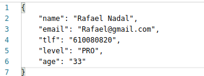

# Despliegue en Vercel

El primer paso para desplegar en Vercel obviamente es registrarnos, linkear nuestro proyecto e instalar las dependencias para poder trabajar localmente. Una explicación de estos pasos más detallada puede encontrarse en el siguiente [ejercicio de autoevaluación](https://github.com/antOnioOnio/IV-autoevaluacion/blob/master/serverles.md#vercel) desarrollado previamente.

Una vez tenemos nuestro repositorio correctamente enlazado, con cada push que hagamos a nuestro repositorio se realizará un despliegue con notificación de si ha sido exitoso o no.

## Configuración previa

Se ha creado un archivo [vercel.json](../vercel.json) donde se especifican los distintos endpoints creados y los distintos métodos que cada uno va a soportar, en nuestro caso y por ahora sólo se ha puesto "POST" y "GET" debido a que por ahora no se permite la actualización, más adelante será añadido. 

Otro archivo creado es [data.json](../api/data.json), el cual contiene los datos que por ahora se van a devolver en nuestros endpoints.

## Funciones desplegadas

Como se ha mencionado antes se han configurado lost endpoint para que también acepten el método POST. Simplemente en nuestro archivo vamos a diferenciar si la petición es get o post y actuar en consecuencia. Los métodos implementados son los siguientes:

- **getPlayers()**. Esta función ha sido desplegada en [este](https://tenis-league-admin.vercel.app/api/players) endpoint. Nos va a devolver todos los jugadores que estan actualmente jugando la liga. Usando postman podemos comprobar que la salida es correcta. 

- **getMatches()**. Esta función ha sido desplegada en [este](https://tenis-league-admin.vercel.app/api/matches) endpoint. Nos va a devolver todos los partidos pertenecientes a la liga, se hayan jugado o estén por jugar.

- **getMatchesOfPlayer(String name)**. Esta función ha sido desplegada en [este](https://tenis-league-admin.vercel.app/api/matches?name=John%20Isner) endpoint. Este endpoint tiene como parámetro name, como es lógico para filtrar los partidos en los que nuestro jugador juegue o haya jugado. Un ejemplo de salida puede verse a continuación, donde como parámetro se le ha pasado "John Isner".

- **getMatchesOfToday()**. Esta función ha sido desplegada en [este](https://tenis-league-admin.vercel.app/api/matches?date=today) endpoint. Nos devuelve los partidos que se juegan en el día en el que se esta realizando la petición.

Gracias a este método y lo realizado con el bot se ha cerrado la [esta](https://github.com/antOnioOnio/TenisLeagueAdmin/issues/44) historia de usuario.

- **postMatch()**. Esta función ha sido desplegada en [este](https://tenis-league-admin.vercel.app/api/matches) endpoint. Para ilustrar un ejemplo de añadir un partido le pasamos en el body los siguientes parámetros:

 

La respuesta nos indica si ha sido correcta o no, en caso afirmativo nos indica el id de nuestro nuevo partido.

 

- **postPlayer()**. Esta función ha sido desplegada en [este](https://tenis-league-admin.vercel.app/api/players) endpoint. Para ilustrar un ejemplo de añadir un jugador le pasamos en el body los siguientes parámetros:

 

La respuesta nos indica si ha sido correcta o no, en caso afirmativo nos indica el id de nuestro nuevo partido.

 

## Archivos 

Las llamadas a la API relacionadas con los partidos se realizan desde [matches.js](../api/matches.js) mientras que las relacionadas con los jugadores se realizan desde [players.js](../api/players.js). 
La implementación de estos métodos esta escrita en nuestro fichero fuente [league.js](../src/models/league.js)

